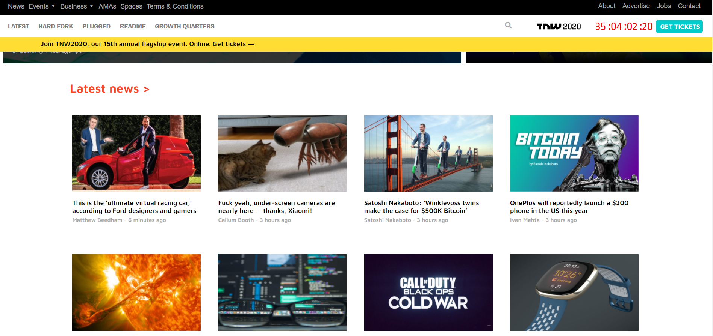

## Building with Responsive Design

</h1>This project is a clone of The Next Web "TNW" ( www.thenextweb.com ).It's responsive to both Mobile & Ipad view and includes two breakpoints :

- The first breakpoint is at 768px.

- The second breakpoint is at 1024px.

The webpage is built using html/css and css positioning technologies ( FLEX GRID FLOAT ).</h1>

## Built With

Html

CSS

Visual code

## Live Demo

[Live Demo Link](https://tnw-clone.netlify.app/)

## Prerequisites

Text editor,Github profile and Git.

## Authors

👤 Khalil Hamdi

- Github: [@khalilhamdii](https://github.com/khalilhamdii)

- LinkedIn: [LinkedIn](https://www.linkedin.com/in/khalilhamdi/)

👤 Mina Anwar

- Github: [@coldatlas](https://github.com/coldatlas)

- LinkedIn: [LinkedIn](https://www.linkedin.com/in/coldyatlas/)

## 🤝 Contributing

Contributions, issues and feature requests are welcome!

Feel free to check the issues page.

Show your support

Give a ⭐️ if you like this project!

## 📝 License

This project is a collaboration project of microverse students. All rights are reserved for

Khalil and Mina.
